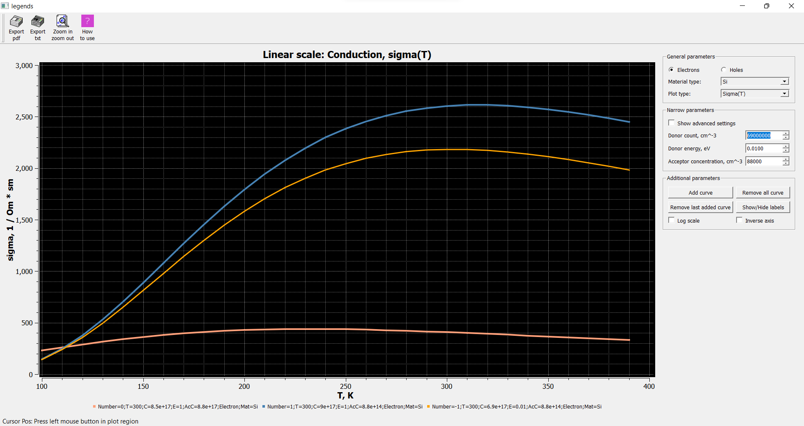

### The program is plotting [different types of curves for semiconductor n-type.](Task/4n.pdf)
#### Build and install to MSCV 2019
This guide is expanded version of [original instruction guide.](https://qwt.sourceforge.io/qwtinstall.html)

**How to build?**
1. In this project we will use `Qt 5.15.0`. You can [download from here.](https://www.qt.io/download)  
2. Download `qwt-6.2.0` [from here](https://sourceforge.net/projects/qwt/files/qwt/6.2.0/qwt-6.2.0.zip/download) to `C:/` folder.  
3. In `Command Prompt` run `cd C:\qwt-6.2.0\` and then `qmake qwt.pro`. Make sure that `Path` variables already has `qmake.exe` path. If not then just run:  
```"C:\PATH_TO_QT\5.15.0\msvc2019_64\bin\qmake.exe" qwt.pro```
It will create `Makefile`.  
4. In the `Command Prompt` run `nmake`. It will build the src. If you have fatall erorr then before `nmake` run:  
```C:\Program Files (x86)\Microsoft Visual Studio\2019\Community\VC\Auxiliary\Build\vcvars64.bat```  
5. Then `nmake install`.  
6. Now you have `lib` and `dll` files. And you can run examples.  

#### Usage:
**How to use?**
1. Select material type, and plot type. Setup narrow parameters (you can see in real-time how changes affect the curve).  
2. Click *Add curve* to fix(save) the curve on the plot to compare the fixed curve with others.  
3. You can set up advanced settings such as steps and limitations for either concentration or temperature.  
4. You can zoom in/out specific area on the plot. Also, you can export curves in either pdf or text. You have to *Add curve* before export.  
5. You can click and hold the mouse to get the value of the holding point under the plot.  
6. The value of current parameters showed under the curve at index -1. Note that any concentration is multiplied to 1e10.  

**Result**

